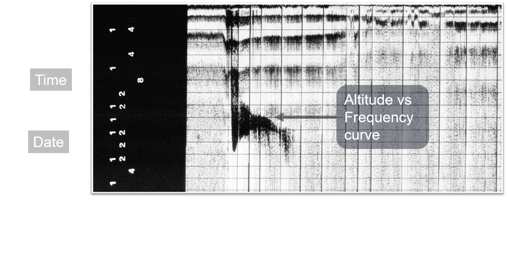
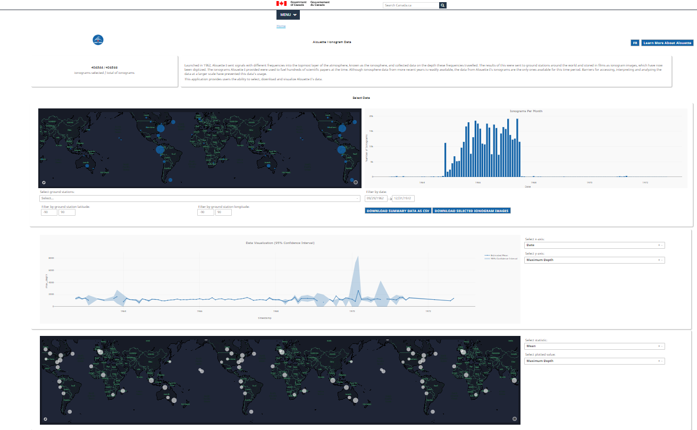
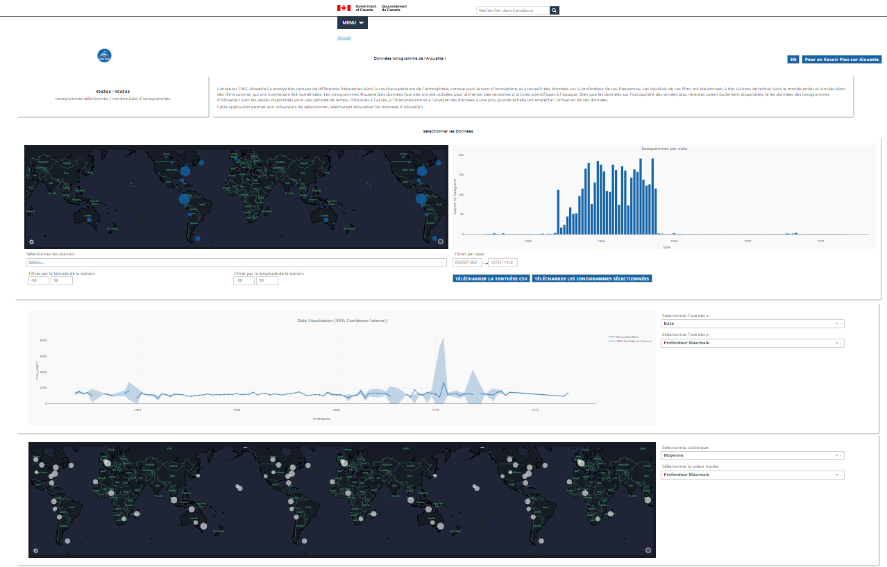

- [En Français](#Application-pour-filtrer,-télécharger-et-visualiser-les-données-Alouette-I)
- [In English](#application-to-filter--download-and-visualize-alouette-i-data)

# Application pour filtrer, télécharger et visualiser les données Alouette-I

## Contexte

Le satellite [Alouette-I](https://www.asc-csa.gc.ca/fra/satellites/alouette.asp) a été le premier satellite canadien lancé dans l'espace. L'objectif 
de son expérience principale était de comprendre la structure de la haute ionosphère. Les données de l'Alouette I sont constitués de centaines de milliers d'ionogrammes dont une proportion sont maintenant stockés numériquement sous forme de fichiers d'images.

Ce projet est une application qui permet aux utilisateurs de filtrer les ionogrammes sur de multiples paramètres et télécharger soit les données extraites des ionogrammes sélectionnés sous forme de CSV, soit les images des ionogrammes eux-mêmes. L'application permet également aux utilisateurs de visualiser un résumé des données des ionogrammes qu'ils ont sélectionnés, à la fois sur une carte et un graphique linéaire, évitant ainsi le téléchargement des données pour des aperçus simples. 

## Démarrage rapide

Les commandes suivantes peuvent être exécutées plus facilement dans un environnement virtuel (comme conda). Il peut donc être judicieux d'installer [Anaconda] (https://www.anaconda.com/distribution/) au préalable. 

Pour démarrer l'application :

- Créer un dossier nommé "data" et y ajouter le fichier "final_alouette_data.csv". Vous devrez aussi ajouter le fichier "config.cfg" dans le même dossier que "alouette.py". Vous trouverez ce fichier sur [Livelink](http://livelink/livelink/llisapi.dll?func=ll&objId=36908608&objAction=browse&viewType=1).

        pip install -r requirements.txt
        python alouette.py

Des instructions d'installation distinctes pour la version de production de l'application sont fournies dans le "Guide d'installation de l'application Alouette Production.docx".

## Construit avec

 - [Plotly Dash](https://dash.plot.ly/) - Le framework Python construit sur Flask a été utilisé pour développer l'application. Tous les composants et visualisations de l'application web sont des objets Dash qui sont créés et mis à jour dans les fonctions de rappel de l'application. Je vous recommande de consulter la documentation complète de Dash (lien) si vous n'êtes pas sûr de son fonctionnement.
 
 - [Jupyter Notebook](https://jupyter-notebook-beginner-guide.readthedocs.io/en/latest/what_is_jupyter.html) - Utilisé pour le nettoyage des données. 

## Navigation et fichiers

 - app.py est l'application principale où chaque composant et la présentation de l'application sont définis 
 
 - controls.py contient les options pour certains des composants (par exemple, les dropdowns)

- header_footer.py contient le html pour l'en-tête et le pied de page du gouvernement du Canada. Ce html est injecté dans l'application principale.
 
 - /assets contient différents fichiers pour le style de l'application (images, redimensionnement, css)
 
 - /data contient les données csv traitées provenant du pipeline d'extraction des caractéristiques

 - /data_cleaning contient des carnets jupyter utilisés pour nettoyer les données ionogrammes extraites

 - messages.pot et /translations contient des informations sur la traduction

 - config.py précise les langues disponibles pour la traduction

## En-tête/pied de page

- Le code de l'en-tête/du pied de page du gouvernement est enregistré dans un fichier séparé (header_footer.py), et est directement injecté dans l'application du tiret.

## Version
Ceci est la v0.1 de l'application Alouette. 

## Traductions

 - Les traductions sont délicates avec Dash en raison de la façon dont il rend la page. Pour savoir comment faire de nouvelles traductions, consultez [https://blog.miguelgrinberg.com/post/the-flask-mega-tutorial-part-xiii-i18n-and-l10n]([https://blog.miguelgrinberg.com/post/the-flask-

Traduit avec www.DeepL.com/Translator (version gratuite)

# Application to filter, download and visualize Alouette-I data

## Background

The [Alouette-I satellite](https://www.asc-csa.gc.ca/eng/satellites/alouette.asp) was the first Canadian satellite launched into space. The goal of its main experiment was to understand the structure of the upper ionosphere. The data from the Alouette I 
satellite consists of hundreds of thousands of ionograms with a proportion now stored digitally as image files.

This project is an application that allows users to filter through ionograms on multiple parameters and download either the selected ionograms’ extracted features as a CSV or the ionogram images  themselves. The application also allows users to visualize a summary of the data from their selected ionograms on both a map and a line chart, forgoing the need for downloading the data for simple insights. 

## Quick start

The following commands can be done more easily if in a virtual environment (like conda) so it may be a good idea to install [Anaconda](https://www.anaconda.com/distribution/) beforehand. 

For starting the application:
- Create a folder named "data" and add the file "final_alouette_data.csv". You will also have to add the "config.cfg" file to the same folder as the "alouette.py" file.You can find this file on [Livelink](http://livelink/livelink/llisapi.dll?func=ll&objId=36908608&objAction=browse&viewType=1).

        pip install -r requirements.txt
        python alouette.py

Separate installation instructions for the production version of the app are provided in "Alouette Production Installation Guide.docx".

## Built with

 - [Plotly Dash](https://dash.plot.ly/) - The Python framework built on top of Flask used to develop the application. All components and visualizations on the web application are Dash objects that are created and updated in the callback functions in app.py. I would recommend that you look over Dash's comprehensive documentation (linked) if you are unsure how it works.
 
 - [Jupyter Notebook](https://jupyter-notebook-beginner-guide.readthedocs.io/en/latest/what_is_jupyter.html) - Used for data cleaning. 

## Navigation and files

 - app.py is the main application where each component and the layout of the application is defined 
 
 - controls.py contains the options for the some of the components (e.g. dropdowns)

- header_footer.py contains the html for the government of Canada header and footer. This html is injected into the main app.
 
 - /assets contains various files for the styling of the application (images, resizing, css)
 
 - /data contains the processed csv data from the feature extraction pipeline

 - /data_cleaning contains jupyter notebooks used to clean the extracted ionogram data

 - messages.pot and /translations contains translation information

 - config.py specifies the languages available for translation

## Downloads

- The max number of ionograms that can be downloaded at once is 100 as of now. These ionograms are currently stored in memory before being sent to the user as a zip; this method may fail for a larger download.

## Roadmap

The current and previous roadmaps can be found on livelink for reference:
[http://livelink/livelink/llisapi.dll?func=ll&objId=39628342&objAction=viewheader]([http://livelink/livelink/llisapi.dll?func=ll&objId=39628342&objAction=viewheader])

## Version
This is v0.1 of the Alouette app. 

## Authors | Auteurs
 - Hansen Liu
 - Wasiq Mohammmad

## Acknowledgments | Remerciments
 - Etienne Low-Decarie
 - Jenisha Patel
 - Cooper Ang
